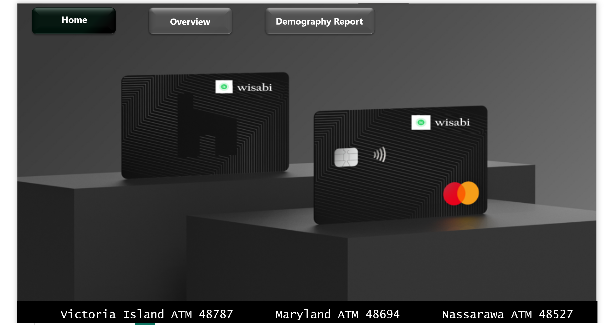
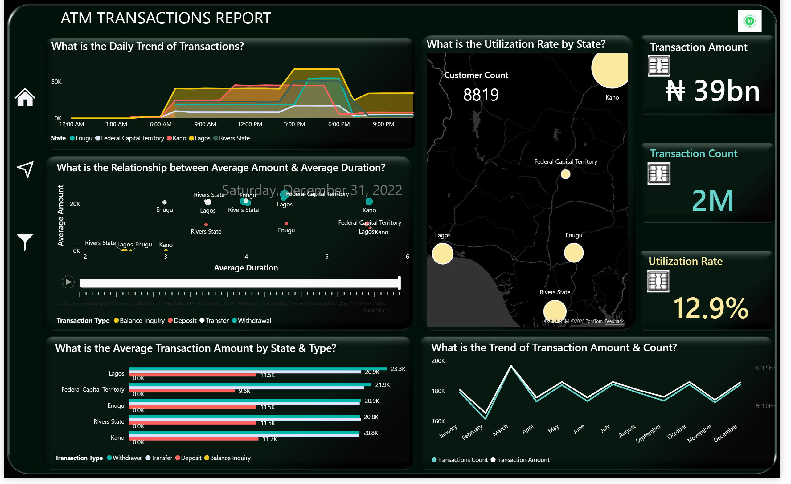
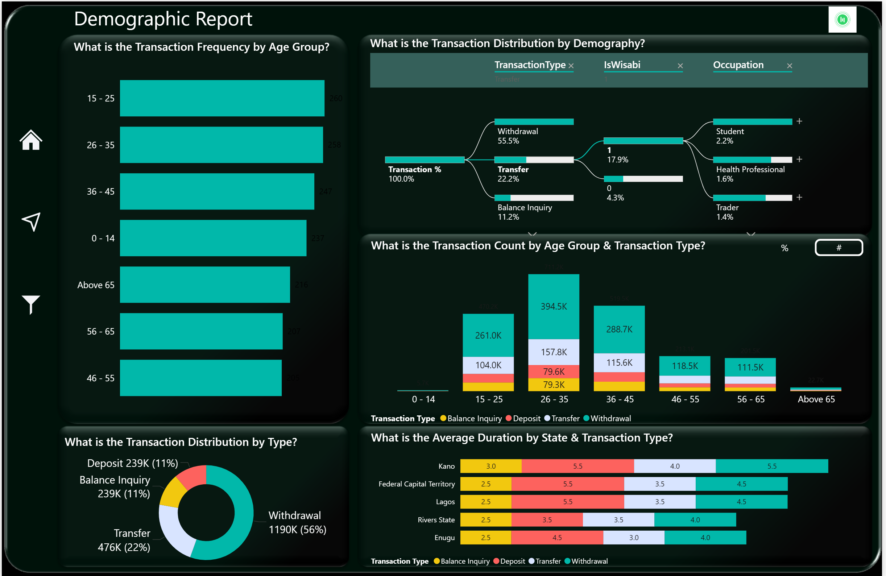

# Wisabi Bank ATM Transaction

<h1>Project Overview</h1>

  The purpose of this project is to analyze the ATM transaction data for Wisabi Bank to gain insights on customer behavior, ATM usage, and identify opportunities to improve the bank's services.

<h3>Steps Involved in the Project</h3>
<ol>
  <li>Data Cleansing using Power Query</li>
  <li>Data Modeling</li>
  <li>Dashboard Creation using Power BI</li>
  <li>Interpretation and Presentation</li>
</ol>

<h1>1:Data Cleansing using Power Query</h1>

Data cleansing is a crucial step to ensure that the data is accurate, consistent, and ready for analysis

<h2>Steps:</h2>

<h3>Import Data:</h3>

Load the raw data into Power Query.
<h3>Remove Duplicates:</h3>

Identify and remove duplicate records to avoid skewed results.
<h3>Handle Missing Values:</h3>

Fill in or remove missing values based on the context and significance.
<h3>Standardize Formats:</h3>

Ensure consistent data formats .
<h3>Transform Data:</h3>

Apply necessary transformations such as splitting columns, merging datasets, and calculating new metrics.

<h3>Tools:</h3>

Power BI for Power Query
Power BI for advanced transformations

<h1>2. Data Modeling</h1>

Data modeling involves structuring the cleaned data into a format suitable for analysis.

<h2>Steps:</h2>

<h3>Create Fact and Dimension Tables:</h3>

 <h3>Fact Table: </h3>
Contains ATM  transaction data 
<h3> Dimension Tables:</h3>
Contain descriptive attributes related to the fact data 

<h3> Define Relationships:</h3>

Establish relationships between fact and dimension tables to enable accurate data analysis.
Example Tables:

 <h3>Fact Table:</h3> 
Kano Transaction table , Lagos Transaction table ,FCT Transaction table and Rivers Transaction table

<h3>Dimension Tables</h3>
Calendar Dimension Table ,Transaction Type Dimension Table,Customers Dimension Table and Location Dimension Table 

<h3>Tools:</h3> 

SQL Server 
Power BI Data Modeling

<h2>3. Dashboard Creation using Power BI</h2>
A dashboard is created to visualize the insights derived from the data.

<h2>Steps:</h2>

<h3>Import Data Model:</h3>

Load the data model into Power BI.
<h3>Create Visualizations:</h3>

Develop visual representations such as bar charts, line graphs, and pie charts to showcase key metrics and trends.
Design Dashboard:

Arrange visualizations in a user-friendly layout for easy interpretation.
Include filters and slicers to enable interactive analysis.

<h3>Key Metrics:</h3>
ATM locations have the highest and lowest utilization rates
Average transaction time by location
transaction amoun
Regional Performance
Distribution of transaction amounts and transaction frequency

<h4>Tools:</h4>
Power BI

<h2>Insights and Recommendations</h2>
<a href="./Wisabi Bank-Report.pptx">View Presentation</a>
